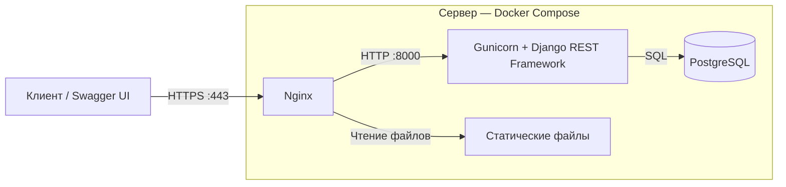
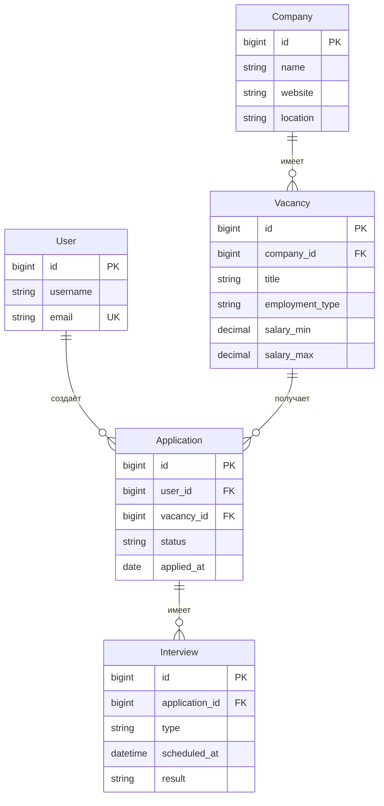

# ApplyFlow

REST API для отслеживания поиска работы: вакансий, откликов и собеседований.

Пользователь сохраняет вакансии, отслеживает статусы откликов, планирует собеседования и получает статистику своих заявок. Проект демонстрирует разработку backend на Django REST Framework: моделирование данных, JWT-аутентификацию, разграничение доступа, валидацию бизнес-правил и автоматизированное тестирование.

## Демо

Проект развёрнут по адресу **https://applyflow.cloud-ip.cc/**.

- [Swagger UI — документация и интерактивная проверка API](https://applyflow.cloud-ip.cc/api/docs/)
- [OpenAPI schema](https://applyflow.cloud-ip.cc/api/schema/)

Начните со Swagger UI: корневой путь `/` не содержит отдельной страницы.

### Как попробовать API

1. Зарегистрируйтесь через `POST /api/users/register/`, передав `username`, `email` и `password`.
2. Получите `access` и `refresh` через `POST /api/users/login/`, передав `username` и `password`.
3. Нажмите **Authorize** в Swagger UI и вставьте значение `access` в поле JWT-аутентификации.
4. Посмотрите каталог вакансий и создайте отклик через `POST /api/applications/`.
5. Проверьте личные отклики и статистику через `GET /api/dashboard/`.

Пример сохранения вакансии (замените `vacancy_id` на существующий ID):

```json
{
  "vacancy_id": 1,
  "status": "saved",
  "source": "company website",
  "notes": "Подготовить резюме под вакансию"
}
```

Для защищённых endpoints вне Swagger используйте заголовок:

```http
Authorization: Bearer <access_token>
```

## Возможности

- Регистрация, JWT-аутентификация, обновление токена и редактирование профиля.
- Каталог компаний и вакансий с поиском, фильтрацией, сортировкой и пагинацией.
- Личные отклики со статусом, источником, заметками и датой подачи.
- HR, технические и финальные собеседования с датой, результатом и заметками.
- Статистика общего количества откликов и распределения по статусам.
- Документация запросов и ответов в Swagger UI.

Статусы отклика: `saved`, `applied`, `screening`, `interview`, `offer`, `rejected`, `withdrawn`.

## Технологии

| Область | Инструменты |
|---|---|
| Backend | Python 3.13, Django, Django REST Framework |
| База данных | PostgreSQL |
| Аутентификация | Simple JWT |
| Поиск и фильтрация | django-filter, фильтры DRF |
| Документация | drf-spectacular, OpenAPI, Swagger UI |
| Тестирование | pytest, pytest-django |
| Развёртывание | Docker Compose, Gunicorn, Nginx, Certbot |

Зависимости приложения зафиксированы в `requirements.txt`.

## Архитектура и технические решения

### Архитектура развёртывания



Nginx принимает HTTPS-запросы и передаёт API-запросы в Gunicorn, который обслуживает Django-приложение. Django REST Framework проверяет аутентификацию и права доступа, валидирует данные и выполняет логику запроса. Django ORM обращается к PostgreSQL, а ответ возвращается клиенту через Nginx.

Статические файлы Nginx отдаёт напрямую. Backend и PostgreSQL взаимодействуют внутри Docker-сети; их порты не опубликованы наружу в основной конфигурации Compose.

### Модель данных (ER-диаграмма)



Показаны основные поля моделей. `PK` — первичный ключ, `FK` — внешний ключ, `UK` — уникальное поле. Связь `||--o{` означает «один ко многим»: например, у компании может быть от нуля до нескольких вакансий, а каждая вакансия относится ровно к одной компании.

Пара `user_id` и `vacancy_id` в таблице откликов уникальна: пользователь может создать только один отклик на конкретную вакансию.

### Django-приложения

Приложения разделены по предметным областям:

| Приложение | Ответственность |
|---|---|
| `users` | Пользователи, аутентификация и профиль |
| `companies` | Каталог компаний |
| `vacancies` | Каталог вакансий |
| `applications` | Личные отклики |
| `interviews` | Собеседования по откликам |
| `dashboard` | Статистика пользователя |
| `config` | Общие настройки, маршруты и разрешения |

### Разграничение доступа

Компании и вакансии доступны для чтения без авторизации. Создавать, изменять и удалять их могут только пользователи с флагом `is_staff`.

Отклики, собеседования и статистика доступны только авторизованным пользователям в пределах их данных. QuerySet ограничивается текущим пользователем; владелец отклика назначается на сервере. При создании или изменении собеседования можно выбрать только собственный отклик.

### Целостность данных

- Повторный отклик на одну вакансию проверяется в сериализаторе и ограничивается уникальным сочетанием пользователя и вакансии в БД.
- Для всех статусов отклика, кроме `saved`, обязательна дата подачи. У сохранённого отклика дата подачи отсутствует.
- Связи с `PROTECT` предотвращают удаление компании с вакансиями и вакансии с откликами; API возвращает `409 Conflict`.
- При удалении отклика связанные собеседования удаляются каскадно.

### Работа с БД и диагностика

Связанные объекты загружаются через `select_related`, чтобы избежать дополнительных запросов при сериализации списков. Распределение откликов по статусам рассчитывается агрегацией в БД.

Создание и удаление объектов, изменения статусов откликов и результатов собеседований записываются в логи.

## Основные endpoints

| URL | Назначение |
|---|---|
| `/api/users/register/` | Регистрация |
| `/api/users/login/` | Получение JWT |
| `/api/users/token/refresh/` | Обновление access token |
| `/api/users/profile/` | Просмотр и редактирование профиля |
| `/api/companies/` | Компании |
| `/api/vacancies/` | Вакансии |
| `/api/applications/` | Личные отклики |
| `/api/interviews/` | Собеседования |
| `/api/dashboard/` | Статистика откликов |

Для CRUD-ресурсов доступны маршруты списка и отдельного объекта `/{id}/`. Параметры фильтрации, допустимые методы и схемы ответов описаны в [Swagger UI](https://applyflow.cloud-ip.cc/api/docs/).

## Локальный запуск через Docker

Требуются Docker и Docker Compose. Выполняйте команды из корня репозитория.

### 1. Настройте окружение

Создайте файл `.env` в корне проекта:

```dotenv
DEBUG=True
SECRET_KEY=replace-with-a-random-local-secret
ALLOWED_HOSTS=localhost,127.0.0.1
CSRF_TRUSTED_ORIGINS=http://localhost:8000

DB_NAME=applyflow
DB_USER=applyflow
DB_PASSWORD=local-development-password
DB_HOST=db
DB_PORT=5432
```

Укажите собственные значения `SECRET_KEY` и `DB_PASSWORD`. Файл `.env` исключён из Git.

### 2. Соберите backend и запустите БД

```bash
docker compose build backend
docker compose up -d db
```

### 3. Примените миграции и создайте администратора

```bash
docker compose run --rm backend python manage.py migrate
docker compose run --rm backend python manage.py createsuperuser
```

Администратор может наполнять каталог компаний и вакансий через Django Admin или API.

### 4. Запустите сервер

```bash
docker compose run --rm -p 8000:8000 backend python manage.py runserver 0.0.0.0:8000
```

- Swagger UI: http://localhost:8000/api/docs/
- OpenAPI schema: http://localhost:8000/api/schema/
- Django Admin: http://localhost:8000/admin/

Этот сценарий запускает PostgreSQL и сервер разработки. Сервис Nginx в `compose.yaml` настроен для домена `applyflow.cloud-ip.cc` и требует TLS-сертификаты в соответствующем Docker volume.

## Тестирование

Проверено **8 октября 2026 года** в локальном виртуальном окружении на Python 3.13.5:

| Проверка | Результат |
|---|---|
| Обычный запуск pytest | **80 passed**, 77,42 секунды |

Использовался pytest 9.1.1.

Тесты проверяют регистрацию и JWT-аутентификацию, CRUD, права доступа, владение объектами, валидацию бизнес-правил, параметры запросов и статистику.

### Запуск тестов

```bash
docker compose run --rm backend pytest
```

Для тестов пользователь PostgreSQL должен иметь право создавать тестовую БД. Пользователь, создаваемый контейнером PostgreSQL в приведённом локальном сценарии, имеет необходимые права.
